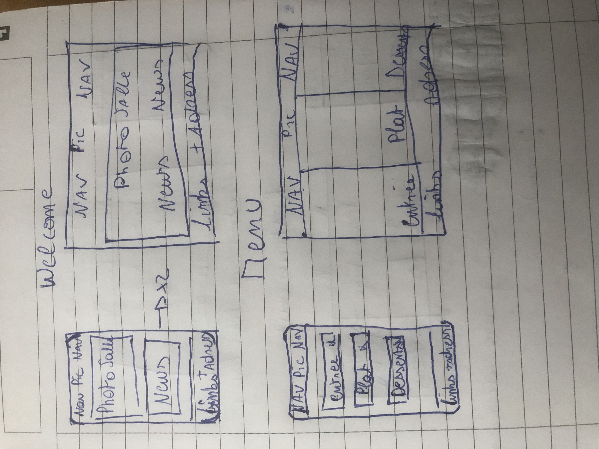
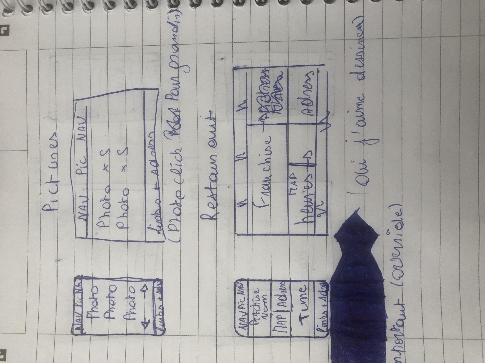
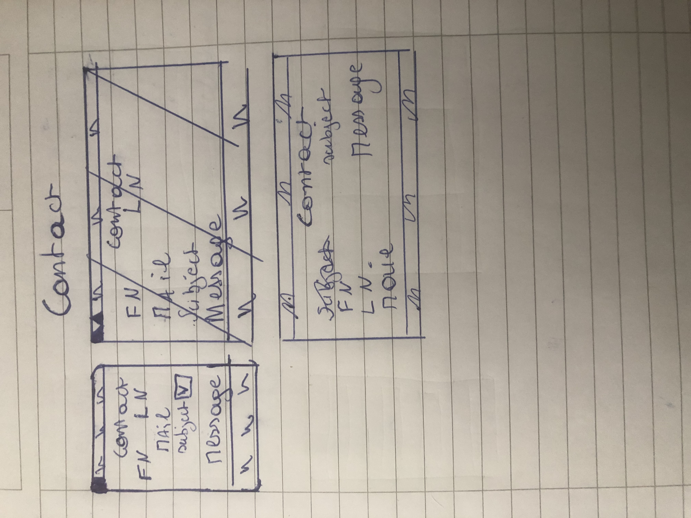

# Readme

## who did it
* Doomsmash (Thomas Quertinmont)

## Challenge
This challenge msut be done bu using bootstrap & Mediaqueries

## Purpose
This challenge helped me to improve my skills in MediaQ & Bootstrap

## Sketch

## Check out
https://doomsmash.github.io/restaurant-css-framework/
